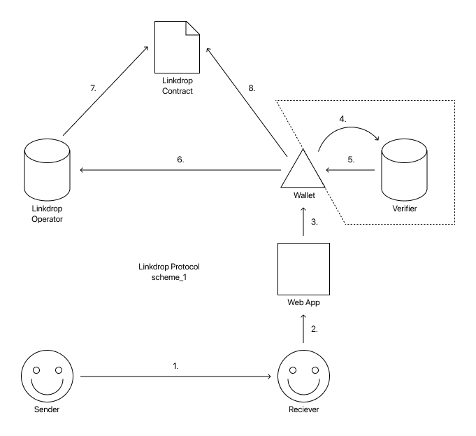

# Linkdrop Protocol Proposal Paper

29 January 2019 / Author: Mikhail Dobrokhvalov / [https://linkdrop.org](https://linkdrop.org)

---

**Linkdrop Protocol** is an open protocol for including digital assets and onboarding properties into links, which enables users and DApps to send crypto without knowing the receivers Ethereum address in advance.

# Technology Overview

## Agents

- Receiver
- Sender (User or DApp)
- Linkdrop Operator — server that calls the Linkdrop Smart-Contract
- Verifier — server that verifies user with one of verification methods (SMS, Email, Google Login, etc.)
- Wallet

## Receiver Flow

1. Sender shares claim link with the receiver;
2. Receiver opens the link in the default browser (or mobile app if it’s a deep link);
3. Web app served by Link Operator (LO) or DApp, redirects receiver to a wallet app of his choice that supports the protocol;
4. Optional: if sender required a verification, then wallet asks verifier to verify receiver (Verifier is chosen by sender and is configured in the Linkdrop Contract);
5. After receiver is verified Verifier provides his signature that receiver is verified;
6. Wallet signs receivers Ethereum address by the transit private key and sends signatures (Verification Signature + Transit Signature + Linkdrop Signature) to the Linkdrop Operator;
7. LO calls Linkdrop Contract and provides signatures to the Linkdrop Contract;
8. Linkdrop Contract verifies signatures and if everything is correct transfer digital assets to the receiver.

## Sender Flow

**DApp sending tokens (one-to-many linkdrop)**

A DApp representative can use special Linkdrop Service (e.g. [Volca](https://volca.tech)) to generate claim links.

**User to User (one-to-one linkdrop)**

In order to transfer via link sender can use:

- Dedicated web-app (like [Eth2.io](http://eth2.io));
- Built-in native wallet interface (wallet can setup it’s own LO or use public one).

# Implementation Goals

- Native support for as much wallets as possible (will bring network effects);
- Set in incentives for Linkdrop Operators to bootstrap initial adoption of the protocol;
- A DApp that allows users to send digital assets via links (user-to-user linkdrops);
- Bootstrap community around the technology.

# Deliveries

- Linkdrop Operator server implementation;
- Verifier server implementation;
- Linkdrop Smart-Contract;
- A DApp for sending and claiming user-to-user linkdrops;
- A service for deploying business-to-users linkdrops;
- Native wallet libraries (Java, Swift, React Native) for sending (user-to-user) and claiming linkdrops.

# Roadmap

## v1, Q1 2019

- Regular (External) Ethereum accounts support (like [Eth2.io](https://eth2.io));
- Support: Ether, ERC20, ERC721;
- User-to-user linkdrops;
- Open-source implementation of a DApp that allows to send and claim one-to-one linkdrops.

## v2, Q2 2019

- Dapp-to-user linkdrop support (like [Volca](https://volca.tech));
- Open-source implementation of a service that allows to send and claim one-to-many linkdrops.

## v3, Q3 2019

- Research and integration with Universal Logins and Meta Transactions;
- Libraries: React Native, iOS, Android;
- Example of Meta Tx implementation combined with linkdrops (like [gasless-wallet.volca.tech](https://github.com/VolcaTech/gasless-webwallet)).

## v4, (Optional) Q4 2019

- Research with Integration with upcoming scalability solutions: Plasma, State Channels, ETH 2.0, ZK-Snark rollups.

---

# More information

- [Linkdrop.org](https://linkdrop.org)
- [Github](https://github.com/LinkdropProtocol)
- [Telegram](https://t.me/eth2io)
- [Twitter](https://twitter.com/eth2io)
